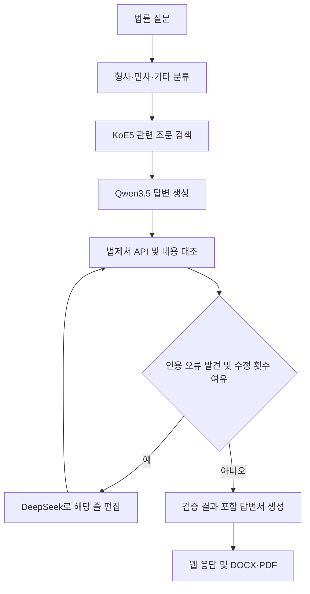

# Legal QA Multi Agent Harness

**한국어 법률 답변의 법조문 인용 오류를 측정하고, 검색·검증·국소 수정으로 줄이는 연구 프로젝트입니다.**

LLM이 작성한 답변에서 법조문 인용을 추출하고, 법제처 Open API로 조문의 실존 여부를 확인합니다. 조문 제목과 본문을 이용해 내용 정합성을 판정하고, 오류가 발견되면 답변 전체를 재생성하거나 해당 인용이 포함된 줄을 수정합니다.

초기 Qwen2.5·EXAONE 기반 측정 실험부터 Qwen3.5·DeepSeek를 사용하는 LangGraph 파이프라인, 웹 데모, DOCX·PDF 답변서 생성까지 포함합니다.

**저장된 KoBLEX 226문항 평가에서 국소 수정 구성의 엄격 가짜 인용률은 2.7%로, RAG 단독의 4.1%보다 상대적으로 34.8% 낮았습니다.** 이 수치는 자동 인용 채점 결과이며, 답변 전체의 법률적 정확도를 의미하지 않습니다.

## 프로젝트가 다루는 문제

법률 답변은 실제 존재하는 조문 번호를 인용하더라도 그 내용을 잘못 설명할 수 있습니다. 따라서 이 프로젝트는 다음을 함께 측정합니다.

- **인용의 실존성:** 인용한 법령·조문·항이 존재하는가?
- **내용 정합성:** 답변의 조문 제목과 주변 문맥이 확인된 조문 내용과 맞는가?
- **근거의 충실도:** 정답 근거로 주어진 조문을 얼마나 인용했는가?

검색만 적용한 경우, 검증 후 전체 답변을 재생성한 경우, 오류가 있는 부분을 국소 수정한 경우를 비교합니다. 이를 통해 검증 과정이 오류를 줄이는지, 수정하면서 새로운 오류를 만들지는 않는지 살펴봅니다.

## 주요 기능

| 기능 | 설명 |
| --- | --- |
| 법조문 검색 | KoE5로 KoBLEX statute 코퍼스에서 관련 조문을 검색해 생성 근거로 제공 |
| 인용 추출·정규화 | 법령 약칭, 조문 번호, 가지번호, 항 등을 처리 |
| 인용 검증 | 법제처 API 조회와 규칙 기반 내용 대조로 실존·불일치·판정 불가를 구분 |
| 국소 수정 | 오류로 판정된 인용의 조문 번호가 등장하는 줄을 DeepSeek로 편집하고 재검증 |
| 비교 실험 | 순수 생성, RAG, 전체 재생성, 국소 수정의 인용 오류율과 gold recall 비교 |
| 웹·문서 출력 | 답변 요지, 조문 원문, 검증 결과, 수정 내역을 표시하고 DOCX·PDF로 저장 |

## 동작 구조

현재 웹 데모는 국소 수정 파이프라인을 사용합니다.



- 생성 단계에 도메인별 IRAC 절차와 CoVe 자기점검 지침을 제공합니다.
- 국소 수정에서는 편집 대상으로 선택되지 않은 줄을 유지하고, 편집 후 답변의 인용을 다시 검증합니다.
- 전체 재생성 모드에서는 DeepSeek가 논리·조문 적용을 검토하며, 사실검증 실패 또는 설정에 따른 논리검증 지적이 재생성을 유발합니다.
- 국소 수정 모드에서는 DeepSeek가 편집을 담당하며, 별도의 논리검증 노드를 거치지 않습니다.

수정 횟수의 기본 상한은 3회입니다. 상한에 도달하면 오류가 남아 있어도 문서 생성 단계로 진행할 수 있으므로, 종료 여부와 인용 검증 결과는 구분해서 확인해야 합니다.

## 평가 결과

저장소에 포함된 LangGraph 평가 결과를 기준으로 합니다.

- **평가셋:** KoBLEX test 226문항, 문항별 중복을 제거한 정답 근거 조문 합계 398건
- **생성 모델:** `Qwen/Qwen3.5-27B`
- **검토·편집 모델:** `deepseek-ai/DeepSeek-R1-Distill-Qwen-32B`
- **채점:** 법제처 Open API, `lawcheck.py`, KoBLEX 정답 근거 조문
- **문서화된 생성 설정:** temperature 0, seed 42

| 구성 | 느슨 가짜 인용률 ↓ | 엄격 가짜 인용률 ↓ | Gold recall ↑ | 수정 라운드 합계 |
| --- | ---: | ---: | ---: | ---: |
| 순수 생성 | 22.0% | 60.1% | 12.3% | 0 |
| RAG 단독 | 3.7% | 4.1% | 48.7% | 0 |
| RAG + 검증 + 전체 재생성 | 3.6% | 5.6% | 49.2% | 158 |
| **RAG + 검증 + 국소 수정** | **1.6%** | **2.7%** | **49.5%** | **44** |

비율은 문항별 비율의 평균이 아니라, 전체 문항의 인용 건수를 합산해 계산했습니다. 수정 라운드 합계는 226문항 전체에서 수행한 재생성 또는 편집 반복 횟수입니다.

이 실험에서 관찰한 주요 결과는 다음과 같습니다.

1. **검색 근거 제공에 따라 인용 오류율이 크게 낮아졌습니다.** 순수 생성과 RAG 단독의 엄격 가짜 인용률은 각각 60.1%, 4.1%였습니다.
2. **검증 후 전체 재생성이 항상 개선으로 이어지지는 않았습니다.** 전체 재생성 구성의 엄격 가짜 인용률은 5.6%로 RAG 단독보다 높았습니다.
3. **국소 수정 구성은 RAG 단독보다 낮은 오류율을 보였습니다.** 엄격 가짜 인용률은 반올림 전 수치 기준으로 상대적 34.8%, 느슨 가짜 인용률은 58.0% 감소했습니다.

각 구성에는 프롬프트, 검증 모델의 역할, 수정 조건 등의 차이가 있습니다. 위 비교는 구성 전체의 결과이며, 국소 편집 하나의 인과 효과나 통계적 유의성을 확정하는 결과로 해석하지 않습니다.

집계 수치와 문항별 결과는 다음 파일에서 확인할 수 있습니다.

- [핵심 비교표](results/lg_compare6.json)
- [순수 생성·전체 재생성 평가](results/lg_eval_n226_both.json)
- [RAG 단독 평가](results/lg_eval_ragonly_n226.json)
- [국소 수정 평가](results/lg_eval_targeted_n226.json)
- [추가 실험 및 분석](legal_agent/RESULTS.md)

## 평가 지표

| 지표 | 정의 |
| --- | --- |
| 느슨 가짜 인용률 | 실존하지 않는 인용 수 ÷ 실존 여부를 판정할 수 있는 인용 수 |
| 엄격 가짜 인용률 | 실존하지 않는 인용 수와 내용 불일치 인용 수의 합 ÷ 엄격 판정이 가능한 인용 수 |
| Gold recall | 실존 판정을 받은 인용 중 정답 근거와 일치하는 조문 수 ÷ 정답 근거 조문 수 |

실존 여부가 `uncertain`인 인용은 두 오류율의 분모에서 제외합니다. 실존하지만 내용을 판정할 수 없는 인용은 엄격 가짜 인용률의 분모에서 추가로 제외합니다.

예를 들어 국소 수정 구성의 느슨 가짜 인용률은 `10/637`, 엄격 가짜 인용률은 `16/594`입니다. 전체 추출 인용 700건 중 실존 판정 불가 63건과 내용 판정 불가 43건이 포함되어 있습니다.

내용 정합성 판정은 제목의 문자 바이그램 유사도와 인용 주변 문맥의 한국어 키워드 중첩을 사용하는 휴리스틱입니다. 추론의 타당성이나 법률적 결론 전체를 평가하는 지표와는 범위가 다릅니다.

## 실행 준비

아래 명령은 저장소 루트에서 실행합니다. 모델 서빙과 검색 인덱스 구축은 Linux·NVIDIA CUDA 환경을 전제로 하며, 제공된 서빙 스크립트는 H200 141GB 한 장을 기준으로 작성되어 있습니다. 기존 환경 문서에 기록된 vLLM 버전은 0.23.0입니다.

### 1. 의존성 설치

```bash
python -m pip install -r requirements.txt
python -m pip install langgraph numpy torch transformers mcp python-docx fastapi "uvicorn[standard]"
```

`requirements.txt`에는 초기 측정용 의존성만 포함되어 있어 RAG·LangGraph·웹·문서 생성용 패키지를 추가로 설치합니다. vLLM은 CUDA·PyTorch와 호환되는 서빙 환경에 별도로 준비해야 합니다. 패키지 버전을 고정한 통합 설치 명세는 제공되지 않습니다.

PDF 출력에는 실행 경로에서 찾을 수 있는 `soffice` 또는 `libreoffice`와 한국어 글꼴이 필요합니다. 변환기를 사용할 수 없으면 PDF 생성은 생략됩니다.

### 2. 법제처 API 인증 설정

국가법령정보 공동활용을 위한 OC 값을 환경변수로 설정합니다.

```bash
export LAW_OC="발급받은_OC_값"
```

### 3. 검색 인덱스 구축

```bash
python build_retrieval.py
```

KoBLEX statute 코퍼스를 KoE5로 임베딩해 `results/statute_emb_fp16.npy` 등을 생성합니다. 인덱스가 없는 환경에서는 최초 1회 실행해야 합니다. 모델과 데이터셋을 처음 불러올 때 다운로드가 발생합니다.

### 4. 모델 서버 시작

```bash
bash legal_agent/serving/vllm_launch.sh
```

| 역할 | 기본 모델 | 기본 주소 |
| --- | --- | --- |
| 답변 생성 | `Qwen/Qwen3.5-27B` | `http://localhost:8010/v1` |
| 논리 검토·국소 편집 | `deepseek-ai/DeepSeek-R1-Distill-Qwen-32B` | `http://localhost:8011/v1` |
| 도메인 분류 | 기본적으로 생성 서버 공유 | 생성 서버와 동일 |

서빙 스크립트는 두 모델을 순차적으로 시작합니다. GPU 메모리 비율과 문맥 길이는 실행 환경에 맞게 조정할 수 있습니다.

## 사용 방법

### 질문 한 건 실행

```bash
LG_EDIT_MODE=targeted python legal_agent/run.py "주택 임차인이 보증금을 보호받기 위한 권리는 무엇인가요?"
```

답변과 인용 검증 결과를 출력하고, 생성된 답변서를 `legal_agent/documents/`에 저장합니다. CLI의 설정 기본값은 전체 재생성이므로 국소 수정을 사용하려면 `LG_EDIT_MODE=targeted`를 지정합니다.

### 웹 데모

모델 서버와 검색 인덱스를 준비한 뒤 실행합니다.

```bash
python -m uvicorn web.app:app --app-dir legal_agent --host 127.0.0.1 --port 7860
```

브라우저에서 `http://localhost:7860`에 접속합니다. 웹 데모는 국소 수정 구성을 사용하며, 답변 요지·결론, 인용 조문 원문과 검증 결과, 수정 전후 내용, 문서 다운로드를 제공합니다.

```bash
curl -X POST http://localhost:7860/api/ask \
  -H "Content-Type: application/json" \
  -d '{"question":"주택 임차인이 보증금을 보호받기 위한 권리는 무엇인가요?"}'
```

웹에서 `LAW_OC`가 없으면 모든 인용을 판정 불가로 처리하는 모의 검증 모드로 실행됩니다. 실제 검증은 OC 설정이 필요합니다. 별도로 제공된 `legal_agent/run_web.sh`는 모델·웹 서버 기동에 더해 Cloudflare 공개 터널을 여는 데모 스크립트입니다.

## 비교 실험 실행

모델 서버, 검색 인덱스, 법제처 OC를 준비한 상태에서 실행합니다. 기존 결과와 구분하기 위해 아래 예시는 새로운 출력 파일명을 사용합니다.

```bash
# 순수 생성과 전체 재생성 구성 비교
LG_EDIT_MODE=regenerate LG_LOGIC_GROUNDED=0 \
  python legal_agent/eval/run_eval.py --n 226 --mode both --baseline-rag off \
  --out results/reproduce_regenerate.json

# RAG 단독
python legal_agent/eval/run_eval.py --n 226 --mode baseline --baseline-rag on \
  --out results/reproduce_rag_only.json

# 국소 수정 구성
LG_EDIT_MODE=targeted python legal_agent/eval/run_eval.py --n 226 --mode proposed \
  --out results/reproduce_targeted.json
```

평가 결과는 문항마다 저장되며, 같은 출력 파일로 재실행하면 기록된 문항을 건너뜁니다. 다른 설정을 비교할 때는 출력 파일도 구분해야 합니다. 일부 사후 분석 스크립트에는 기존 실험 환경의 절대 경로가 남아 있습니다.

### 모델 서버 없이 기본 로직 확인

```bash
python selftest.py
LG_EDIT_MODE=regenerate python legal_agent/smoke_test.py
python legal_agent/smoke_targeted.py
```

인용 추출·정규화와 모의 모델을 이용한 검증·수정 흐름을 확인합니다. 이 확인에는 모델 서버와 법제처 OC가 필요하지 않으며, LangGraph 테스트에는 해당 패키지 설치가 필요합니다.

## 주요 설정

| 환경변수 | 기본값 | 설명 |
| --- | --- | --- |
| `LAW_OC` | 미설정 | 법제처 API 인증 값 |
| `LG_EDIT_MODE` | `regenerate` | CLI·평가의 수정 방식: `regenerate` 또는 `targeted` |
| `LG_MAX_RETRY` | `3` | 최대 수정 라운드 |
| `LG_RAG_TOPK` | `3` | LangGraph에서 검색할 조문 수 |
| `LG_GEN_MODEL` / `LG_GEN_BASE_URL` | 위 모델 표 참조 | 생성 모델과 서버 주소 |
| `LG_LOGIC_MODEL` / `LG_LOGIC_BASE_URL` | 위 모델 표 참조 | 검토·편집 모델과 서버 주소 |
| `LG_LOGIC_TRIGGERS_RETRY` | `1` | 전체 재생성 모드에서 논리검증 지적으로 재생성할지 여부 |
| `LG_LOGIC_GROUNDED` | `0` | 전체 재생성 모드에서 근거 대조를 강화한 논리검증 사용 여부 |
| `LG_TEMPERATURE` / `LG_SEED` | `0.0` / `42` | 생성 설정 |

자세한 설정은 [config_lg.py](legal_agent/config_lg.py)를 참고하세요. 초기 실험의 모델 설정은 루트의 [config.py](config.py)에서 관리합니다.

## 저장소 구조

```text
legal-citation-faithfulness/
├── lawcheck.py              # 인용 추출·정규화·법제처 검증
├── questions.py             # 시드 질문, KCL·KoBLEX 로더
├── build_retrieval.py       # KoE5 검색 인덱스 구축
├── run_baseline.py          # 초기 인용 오류 측정
├── run_koblex.py            # KoBLEX 평가 및 공통 채점 함수
├── run_main.py / run_main3.py   # 검증 전략 비교 실험
├── agent_pipeline.py        # 기존 통합 파이프라인과 MCP 문서 호출
├── docx_mcp_server.py        # DOCX 생성 및 PDF 변환
├── legal_agent/
│   ├── graph.py             # LangGraph 구성과 수정 분기
│   ├── runtime.py           # 검색·모델·검증·문서 도구 연결
│   ├── config_lg.py         # 모델·검색·수정 설정
│   ├── nodes/               # 분류·검색·생성·검증·편집·문서 노드
│   ├── eval/                # 비교 평가와 결과 분석
│   ├── web/                 # FastAPI 웹 데모
│   ├── serving/             # vLLM 실행 스크립트
│   └── RESULTS.md           # LangGraph 실험 분석
├── skills/                  # 형사·민사 검증 지침
├── cases/                   # 오류 사례 및 초기 실험 분석
├── results/                 # 평가 결과·검색 산출물
└── cache/                   # 법제처 API 응답 캐시
```

## 현재 범위와 한계

- **자동 인용 채점 중심입니다.** 정규식 추출과 내용 대조 휴리스틱은 오탐·미탐이 있을 수 있으며, 판례의 타당성이나 답변 전체의 법률적 완결성을 보장하지 않습니다.
- **판정 불가 항목을 함께 봐야 합니다.** 낮은 오류율만으로 모든 인용이 검증됐다고 해석할 수 없습니다.
- **검색과 데이터 시점의 영향을 받습니다.** 검색되지 않은 근거를 놓칠 수 있으며, 코퍼스·API 응답·캐시의 법령 시점 차이는 별도 검토가 필요합니다.
- **실험 조건에 한정된 결과입니다.** 제시한 비교표에는 신뢰구간이나 반복 실행에 따른 분산 추정이 포함되어 있지 않습니다.
- **국소 수정도 줄 단위로 동작합니다.** 편집 대상 줄 내부의 정상 인용까지 항상 보존한다고 보장하지는 않습니다.

그래프 내부의 내용 대조에는 검색된 조문을 사용하고, 평가 시에는 KoBLEX 정답 근거를 사용해 재채점합니다. 두 단계의 판정은 같지 않을 수 있습니다.

## 사용 데이터·구현 참고

- 데이터 로더: `JihyungL/KoBLEX-koblex`, `JihyungL/KoBLEX-statute`, `lbox/kcl`
- 임베딩 모델: `nlpai-lab/KoE5`
- 인용 검증 구현 참고: [korean-law-mcp](https://github.com/chrisryugj/korean-law-mcp)
- 초기 실험 분석: [cases](cases/), [main_summary.md](results/main_summary.md), [main3_summary.md](results/main3_summary.md)
